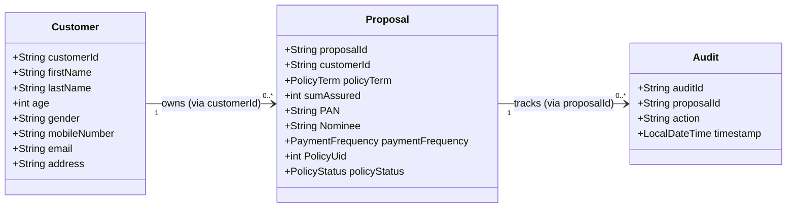

# Design Decisions

This document outlines the architectural patterns, domain design, and technical decisions implemented in the **Policy Proposal Processing API**. It serves as a technical walkthrough of the codebase, reflecting the design choices made to satisfy the evaluation requirements.

---

## 1. Project Overview

The objective of this project is to implement a robust, lightweight Spring Boot REST API that simulates a simplified insurance policy proposal system. The system manages the lifecycle of customer registration, policy proposal creation, validations, state transitions, and audit trail logging.

To fulfill the constraint of not requiring a persistence engine, the application is designed around in-memory storage using standard Java Collections, while preserving a decoupled, production-grade codebase structure.

---

## 2. Architecture

The application adopts a classic **Layered (n-tier) Architecture** to ensure clean separation of concerns. The layers are structured as follows:

```text
       +---------------------------------------+
       |           Client / REST API           |
       +-------------------+-------------------+
                           |
                           v  [DTO Request]
       +-------------------+-------------------+
       |           Controller Layer            |
       |  (HTTP Mappings, Syntax Validation)   |
       +-------------------+-------------------+
                           |
                           v  [Service Request]
       +-------------------+-------------------+
       |             Service Layer             |
       |    (Business Workflows, Rules,        |
       |     Validation Component Integration) |
       +-------------------+-------------------+
                           |
                           v  [Domain Entity]
       +-------------------+-------------------+
       |           Repository Layer            |
       |      (In-Memory Map Abstractions)     |
       +---------------------------------------+
```

### Layer Responsibilities

1. **Controller Layer (`com.policy.api.controller`)**:
   - Exposes REST endpoints and maps incoming HTTP requests to Java method calls.
   - Enforces basic syntactic input constraints (e.g., checks for missing fields or malformed formats) using Jakarta Bean Validation.
   - Returns appropriate HTTP status codes and payloads, delegating all operations to the service layer.

2. **Service Layer (`com.policy.api.service`)**:
   - Orchestrates the core business workflows (e.g., customer creation, proposal submission).
   - Coordinates transactional-like behaviors, integrates the programmatic validation component, and handles model-to-DTO mapping.
   - Bridges the controllers and repositories, keeping the API layer isolated from data access logic.

3. **Repository Layer (`com.policy.api.repository`)**:
   - Manages data retrieval and mutations from the in-memory store.
   - Encapsulates storage mechanics (`ConcurrentHashMap`) so that the services remain unaware of how the data is persistent or retrieved.

### Benefits of Separation of Concerns
- **Maintainability**: Changes in the API contract (e.g., changing JSON keys) only affect the Controller and DTO layers. The core business rules in the service layer remain completely untouched.
- **Testability**: Each layer can be tested in isolation. Controllers can be unit tested by mocking services, and services can be verified using mock repositories, removing external execution overhead during testing.

---

## 3. Domain Model

The system operates on three primary domain entities:



- **Customer**: Represents the policyholder. Key properties include demographics (`age`, `gender`) and contact information.
- **Proposal**: Captures the insurance request details, including terms (`policyTerm`), financial numbers (`sumAssured`, `premium`), status (`policyStatus`), and nominee details.
- **Audit**: Tracks system actions performed on a proposal, recording the activity text and a timestamp.

### Entity Relationships
The entities are decoupled at the object-reference level. Instead of using object references (like `@OneToMany List<Proposal>`), relationships are stored via foreign identifier attributes (e.g., `customerId` inside `Proposal` and `proposalId` inside `Audit`). This mirrors relational database structures, avoids serialization recursion issues, and matches the lightweight repository architecture.

---

## 4. DTO Strategy

Data Transfer Objects (DTOs) are introduced in both request and response paths:
- **Request DTOs** (`CustomerRequest`, `ProposalRequest`, `AuditRequest`)
- **Response DTOs** (`CustomerResponse`, `ProposalResponse`, `AuditResponse`, `ReferenceDataResponse`)

```text
 [Client]  ====== DTO ======>  [Controller]  ====== Entity ======>  [Service]
 [Client]  <===== DTO =======  [Controller]  <===== DTO =========  [Service]
```

### Benefits of the DTO Pattern
- **Decoupling API Contracts**: Internal domain entities can evolve freely (e.g., database mappings, helper methods, internal fields) without altering the external-facing JSON structure.
- **Hiding Internal Details**: Sensitive or read-only properties, such as generated IDs or calculated states (e.g., `policyUid` or `policyStatus`), are omitted from request DTOs so that clients cannot write directly to them.
- **Ease of API Versioning**: When requirements change, we can adapt incoming DTO attributes or handle structural migrations within the service layer mapping, keeping the public contract stable.

---

## 5. Repository Design

To store entities, the project implements a clean repository pattern utilizing **`ConcurrentHashMap`**:

```java
private final Map<String, Customer> map = new ConcurrentHashMap<>();
```

### Core Design Details
- **Thread Safety**: Insurance processing platforms are multi-threaded environments where multiple HTTP request threads access shared data. `ConcurrentHashMap` provides highly optimized, thread-safe write/read concurrency without needing global synchronized blocks, avoiding thread contention.
- **Data Abstraction**: The repositories (`CustomerRepository`, `ProposalRepository`, `AuditRepository`) expose simple methods like `save()`, `get()`, and `update()`. 
- **Requirement Compliance**: This completely satisfies the assignment requirements by using standard JDK Collections while simulating a real-world persistence interface.

---

## 6. Business Validation

Validation is split into two logical phases: **Syntactic (Input) Validation** and **Semantic (Business) Validation**.

| Category | Responsibility | Technology | Example |
| :--- | :--- | :--- | :--- |
| **Input Validation** | Checking request formatting, null checks, and basic constraints. | `jakarta.validation` annotations on DTOs. | Email format, mobile regex (`^[6-9]\d{9}$`), minimum age bound. |
| **Business Validation** | Enforcing complex state rules, range validation, and cross-entity checks. | Programmatic Java component (`Validation.java`) & Service layer logic. | Sum Assured range checks, PAN requirements based on premium, Nominee matching. |

### Implemented Business Rules
1. **Customer Age**: Restricts customer registration to ages between 18 and 65.
2. **Policy Term**: Limits choices to allowed intervals (`10`, `15`, `20`, `25`, `30`).
3. **Assured Sum**: Must be in the range of ₹100,000 to ₹50,000,000.
4. **Minimum Premium**: Annual premium must be at least ₹5,000.
5. **PAN Requirement**: PAN number is mandatory if the premium exceeds ₹50,000 and must match the pattern `^[A-Z]{5}\d{4}[A-Z]$`.
6. **Nominee Restriction**: The nominee cannot be the same as the customer's full name (case-insensitive combination of customer's first name and last name).

### Why Business Validation Belongs in the Service Layer
Controllers should only validate requests for syntax. Complex rules require context, such as database lookups (e.g., retrieving the customer profile to compare its full name against the proposal's nominee). Encapsulating these rules in the service layer (via `Validation.java`) ensures they can be unit-tested without launching an HTTP server context, reinforcing business logic reliability.

---

## 7. Exception Handling

Error handling is centralized using Spring's **`GlobalExceptionHandler`** annotated with `@RestControllerAdvice`.

### Architectural Execution
- **Custom Exceptions**: Specialized runtime exceptions are thrown under specific business conditions (e.g., `CustomerNotFoundException`, `ProposalNotFoundException`, `InvalidCustomerException`, `InvalidProposalException`, `ProposalAlreadySubmittedException`).
- **Consistent Response Payload**: The handler captures these exceptions and structures them into a standard `ErrorResponse`:
  ```json
  {
    "timestamp": "2026-07-17T04:20:15.584",
    "status": 400,
    "error": "Bad Request",
    "message": "Customer age must be between 18 and 65 years.",
    "path": "/customers"
  }
  ```
- **HTTP Status Codes**:
  - `400 Bad Request`: Validation and business rule errors.
  - `404 Not Found`: Missing resources (Customer or Proposal lookup failures).
  - `500 Internal Server Error`: Caught unexpected system errors.

Centralized exception handling prevents leakages of internal stack traces, improves system security, and provides API consumers with predictable, structured error logs.

---

## 8. Audit Design

Auditing is structured as a dedicated entity (`Audit`) and service workflow (`AuditService`). 

### Submission Auditing
- **Triggers**: Audits are created **only** when a proposal is officially submitted via `POST /proposals/{id}/submit`.
- **Logic**: Creating a proposal puts it in a draft state (`PolicyStatus.PENDING`). In insurance workflows, draft creations are highly frequent and do not impact active policies. Proposal submission, however, changes the status to `ACCEPTED` and generates a binding `policyUid`. Because this is a critical transaction, a permanent audit trail is captured:
  ```java
  auditService.createAudit(new AuditRequest(generator.generateAuditId(), updatedProposal.getProposalId(), "Proposal submitted successfully"));
  ```
- **Independence**: Separating the `Audit` entity from `Proposal` ensures that proposal tables remain unburdened, and allows fetching audit history independently through the `/audits` endpoint.

---

## 9. Policy Number Generation

Identifier and policy number generation are decoupled into a dedicated `IdGenerator` component utilizing thread-safe counters:

```java
private final AtomicInteger customerCount = new AtomicInteger(0);
private final AtomicInteger proposalCount = new AtomicInteger(0);
private final AtomicInteger auditCount  = new AtomicInteger(0);
private static final AtomicInteger counter = new AtomicInteger(100000);
```

- **Prefix Generation**: String formats generate descriptive, readable keys:
  - Customers: `CUS` + 3-digit padded number (`CUS001`, `CUS002`)
  - Proposals: `PRO` + 3-digit padded number (`PRO001`, `PRO002`)
  - Audits: `AUD` + 3-digit padded number (`AUD001`, `AUD002`)
- **Policy Numbers**: An atomic counter initializes at `100000` and yields unique sequential 6-digit integers (e.g., `100001`) upon proposal submission.
- **Design Choice**: The implementation is intentionally simple, thread-safe, and structured around `AtomicInteger` because persistent sequencing databases are out of scope.

---

## 10. Testing Strategy

The test suite validates components using **JUnit 5** and **Mockito**.

- **Validation Tests (`ValidationTest`)**: Perform exhaustive assertion testing on the business rules. It tests boundary conditions (e.g., exact age bounds of 17, 18, 65, 66) and checks PAN conditions at varying premium thresholds.
- **Service Tests**: Cover workflows in `CustomerServiceTest`, `ProposalServiceTest`, and `AuditServiceTest`. By utilizing Mockito's mock injections (`@Mock`, `@InjectMocks`), the service behavior is tested independently of repositories and ID generators.
- **Workflow Verification**: Validates the proposal submission flow, verifying that a submission triggers state changes, policy numbers are assigned, and audit records are created, while preventing double submissions.
- **Minimal Repository Testing**: The repository classes are simple wrapper calls to Java's built-in `ConcurrentHashMap`. Testing them extensively provides no engineering value, as it would only verify standard JDK map functionality.

---

## 11. Trade-offs

During development, several engineering trade-offs were made:

- **In-Memory Storage vs. Database Persistence**: 
  - *Trade-off*: Used JVM memory maps instead of an embedded database (like H2). 
  - *Rationale*: Eliminates JDBC configuration, entity annotations, and database startup times, aligning with lightweight project instructions, at the expense of data durability across restarts.
- **Manual DTO Mapping vs. MapStruct**: 
  - *Trade-off*: Utilized manual mapping constructors in the service layer rather than MapStruct.
  - *Rationale*: Keeps external library dependencies low and project footprint simple. However, it increases boilerplate mapping code in service files.
- **Sequential Atomic IDs vs. UUIDs**: 
  - *Trade-off*: IDs are sequential integers instead of globally unique identifiers (UUIDs).
  - *Rationale*: Highly readable for developers during evaluation (`CUS001` vs. `d3b07384d-13ed...`). However, sequential IDs are not safe for distributed systems and expose internal sequence volumes to users.
- **Split Validation vs. Unified Annotation Validation**: 
  - *Trade-off*: Basic checks are handled by annotations, while domain rules are run programmatically in `Validation.java`.
  - *Rationale*: Keeps business validations highly testable via plain JUnit tests without Spring's context, but splits validation rules across two layers.
- **Synchronous vs. Asynchronous Audit Logging**: 
  - *Trade-off*: Audit records are saved synchronously on the HTTP request thread during submission.
  - *Rationale*: Simple implementation with guaranteed order consistency, but blocks the main HTTP response flow.

---

## 12. Assumptions

- **Single Instance Deployment**: The application runs on a single node. Multi-node clustering is out of scope (as clustered environments would cause key collisions in the atomic generators and data divergence across memory maps).
- **Ephemeral Data Lifecycle**: Data exists purely within the application process lifecycle and is wiped clean upon restarts.
- **Security Context**: Authenticating user identities, defining roles, and encrypting payloads are out of scope.
- **Idempotent Submission**: A proposal status transitions only once from `PENDING` to `ACCEPTED`. Resubmitting an already accepted proposal is blocked.
- **Auditing**: Audit creation is transactional and runs immediately following a proposal state transition.

---

## 13. Future Improvements

To transform this system into a production-ready cloud service, the following architectural upgrades would be recommended:

1. **Database Integration**: Introduce **Spring Data JPA** with a relational database (e.g., PostgreSQL). This will enable database-level transaction management (`@Transactional`) and schema migrations via Flyway or Liquibase.
2. **API Documentation**: Integrate **Springdoc-OpenAPI** to auto-generate Swagger endpoints and support direct API sandbox testing.
3. **Security Integration**: Implement **Spring Security** using JWT tokens or OAuth2 to manage client authentication and role-based route permissions.
4. **Asynchronous Processing**: Refactor audit logging to run asynchronously using Spring's `@Async` or a message broker (e.g., RabbitMQ, Kafka) to prevent audit writes from delaying the client's HTTP response.
5. **MapStruct Mapping**: Replace manual constructors with MapStruct interfaces to eliminate boilerplate mapping code and maintain clean class files.
6. **Containerization**: Write a multi-stage `Dockerfile` and `docker-compose.yml` to simplify localized execution and standard cloud deployments.
